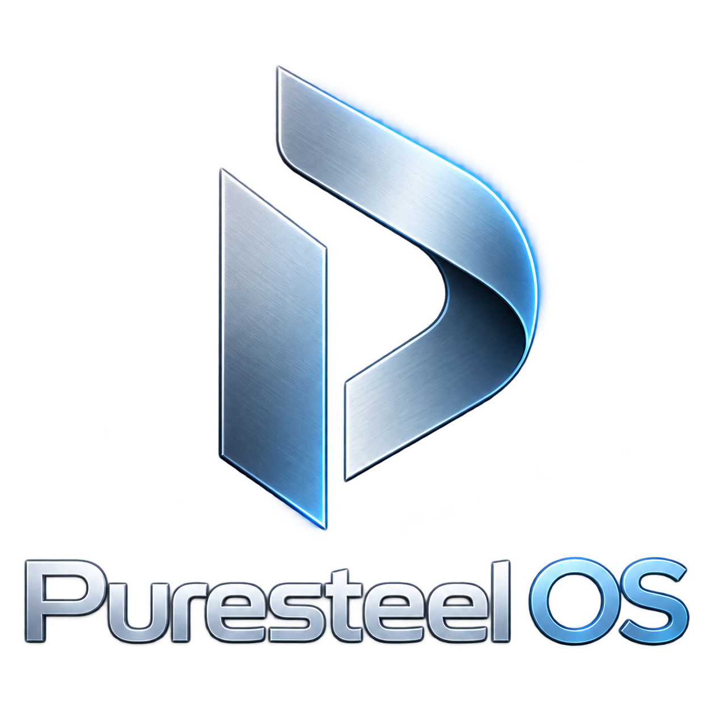

<p align="center">
  
</p>

<h1 align="center">Puresteel</h1>

<p align="center">
  <a href="README.md">English</a> · <a href="README.tr.md">Türkçe</a> · <a href="https://mozcelik14.github.io/Puresteel-OS/">Web sitesi</a>
</p>

---

Puresteel; temiz bir masaüstü deneyimi, oyun ve içerik üretimi araçları, geniş ekran kartı desteği, grafiksel kurulum aracı ve kendi sistem yönetimi/güncelleme altyapısına odaklanan Debian 13 (Trixie) tabanlı bağımsız bir Linux dağıtımıdır.

Puresteel'in güncel masaüstü yığını **KDE Plasma 6 + SDDM + Breeze Light; Wayland ve X11 alternatifi** şeklindedir. ISO oyun, içerik üretimi ve geliştirme uygulamalarını hazır sunar.

## ISO'yu tek komutla oluştur

### Linux

Debian, Ubuntu veya Linux Mint benzeri APT tabanlı bir sistemde:

```bash
curl -fsSL https://raw.githubusercontent.com/MOzcelik14/Puresteel-OS/main/bootstrap.sh | bash
```

### Windows 10 / 11

PowerShell'de şunu çalıştır:

```powershell
irm https://raw.githubusercontent.com/MOzcelik14/Puresteel-OS/main/windows-build.ps1 | iex
```

Windows betiği WSL2 ve Debian/Ubuntu ortamını otomatik kullanır. WSL kurulu değilse ilk çalıştırma Windows'un WSL/Debian kurulumunu başlatır. Windows bir kez yeniden başlatma veya ilk Linux kullanıcısını oluşturma isteyebilir; sonrasında aynı komutu tekrar çalıştırmanız yeterlidir.

Elle veya geliştirme amaçlı build için [docs/BUILD.md](docs/BUILD.md) belgesine bakabilirsiniz.

## Genel bakış

| | |
|---|---|
| **Taban** | Debian 13 (Trixie) |
| **Mimari** | amd64 + i386 multiarch |
| **Masaüstü** | Plasma 6 / SDDM / Wayland + X11 |
| **Kurulum** | Calamares |
| **Init** | systemd |
| **Grafik** | Intel, AMD ve NVIDIA; hibrit GPU desteği |
| **Uygulamalar** | APT + Flatpak / Flathub |
| **Kabuk** | Fish + Starship |
| **Güncellemeler** | Debian APT + imzalı Puresteel APT deposu + Flatpak |

## Puresteel Center

Puresteel kendi Qt 6 / PySide6 sistem yönetim uygulamasıyla gelir. Güncellemeler, uygulamalar, sürücüler, kaynaklar, yedekleme ve sistem raporlarını tek arayüzde toplar. Türkçe ve İngilizce arayüz desteklenir.

[Puresteel Center dokümantasyonu →](docs/PURESTEEL_CENTER.md)

## Grafik desteği

- **Intel** — Linux/Mesa üzerinden entegre grafikler ve Arc sınıfı harici kartlar
- **AMD** — `amdgpu` / Mesa üzerinden entegre ve harici Radeon GPU'lar
- **NVIDIA** — Debian proprietary sürücü yığını, DKMS, Vulkan ve hibrit grafik entegrasyonu
- **Hibrit sistemler** — Intel + NVIDIA, AMD + NVIDIA ve Linux grafik yığınının desteklediği diğer çoklu GPU düzenleri

Önceki Cinnamon imajı Intel + NVIDIA RTX 3050 cihazda test edilmiştir; yeni minimal Plasma sürümü için ayrı kurulum ve donanım testi gerekir.

[Donanım dokümantasyonu →](docs/HARDWARE.md)

## Oyun ve içerik üretimi

Tam donanımlı ISO; Steam başlatıcısı, Wine 32/64-bit, Winetricks, 32-bit Vulkan/Mesa/NVIDIA kullanıcı alanı, Heroic Games Launcher, ProtonUp-Qt, Kdenlive, Audacity, FFmpeg, ONLYOFFICE ve geliştirme araçlarını içerir. Heroic, ProtonUp-Qt ve ONLYOFFICE sistem Flatpak olarak önceden kurulur. Steam istemcisi ilk açılışta güncellemelerini indirebilir; oyunlar ve Proton sürümleri ISO'ya dahil değildir.

## Power-user varsayılanları

Puresteel; Fish, Starship, Fastfetch, btop, htop, Git, curl, wget, Vim, Nano, fzf, ripgrep, fd-find, bat, tmux ve arşiv araçlarıyla gelir. ZRAM zstd sıkıştırmasıyla etkinleştirilmiştir ve Puresteel'e özgü bellek ayarları kullanılır.

## Masaüstü ve branding

Puresteel KDE Plasma 6, SDDM, açık Breeze Light teması, Puresteel duvar kağıdı, ikonları, GRUB, Plymouth ve Calamares kimliğini kullanır. NVIDIA uyumluluğu için X11 oturumu da korunur. Sistem dili Puresteel Language Settings üzerinden değiştirilebilir.

## Kurulum

Oluşturulan hybrid ISO'yu USB belleğe yazın, UEFI modunda Puresteel live ortamını başlatın ve masaüstündeki Calamares kurucusunu açın.

[Kurulum rehberi →](docs/INSTALL.md)

## Dokümantasyon

- [Web sitesi](https://mozcelik14.github.io/Puresteel-OS/)
- [Kurulum](docs/INSTALL.md)
- [Puresteel build rehberi](docs/BUILD.md)
- [Puresteel Center](docs/PURESTEEL_CENTER.md)
- [Güncellemeler ve APT deposu](docs/UPDATES.md)
- [Donanım ve grafik](docs/HARDWARE.md)
- [Sorun giderme](docs/TROUBLESHOOTING.md)
- [Değişiklik günlüğü](CHANGELOG.md)
- [Sürüm notları](RELEASE_NOTES.md)

## Sürüm geçmişi

Yayınlanmış `v1.0.0` etiketi, ilk Puresteel 1.0 "Burak" sürümünün tarihsel kaydı olarak korunur. Güncel tam donanımlı Plasma sürümü `main` dalında geliştirilir; eski sürüm geçmişi yeniden yazılmaz.

## Lisanslama

Puresteel farklı upstream lisanslara sahip yazılımları bir araya getirir. Debian paketleri, Flatpak uygulamaları ve üçüncü taraf bileşenler kendi lisanslarını korur. Yapılandırmaya bağlı olarak imaj Debian non-free firmware ve proprietary NVIDIA bileşenleri içerebilir.
